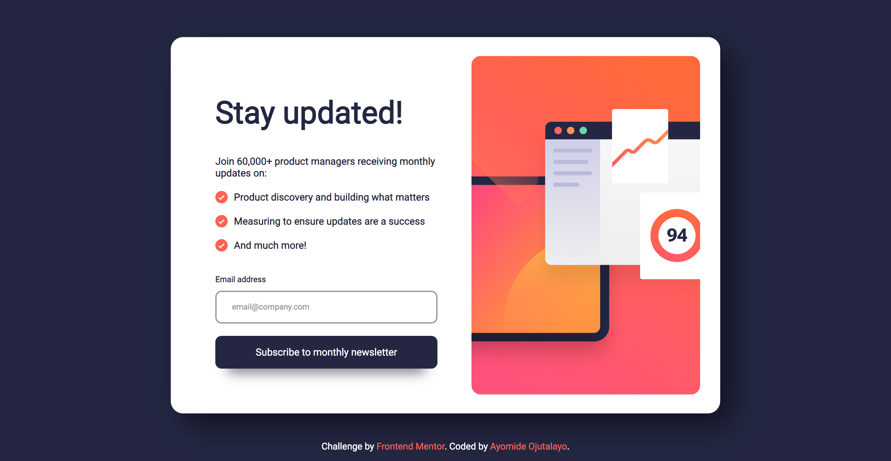

# Frontend Mentor - Newsletter sign-up form with success message solution

This is a solution to the [Newsletter sign-up form with success message challenge on Frontend Mentor](https://www.frontendmentor.io/challenges/newsletter-signup-form-with-success-message-3FC1AZbNrv). Frontend Mentor challenges help you improve your coding skills by building realistic projects.

## Table of contents

- [Overview](#overview)
  - [The challenge](#the-challenge)
  - [Screenshot](#screenshot)
  - [Links](#links)
- [My process](#my-process)
  - [Built with](#built-with)
  - [What I learned](#what-i-learned)
  - [Continued development](#continued-development)
  - [Useful resources](#useful-resources)
- [Author](#author)
- [Acknowledgments](#acknowledgments)

## Overview

### The challenge

Users should be able to:

- Add their email and submit the form
- See a success message with their email after successfully submitting the form
- See form validation messages if:
  - The field is left empty
  - The email address is not formatted correctly
- View the optimal layout for the interface depending on their device's screen size
- See hover and focus states for all interactive elements on the page

### Screenshot



### Links

- Solution URL: [Solution URL here](https://github.com/ojutalayomi/Newsletter-sign-up)
- Live Site URL: [Live site URL here](https://ojutalayomi.github.io/Newsletter-sign-up/)

## My process

### Built with

- Semantic HTML5 markup
- CSS custom properties
- JavaScript

### What I learned

This is just part of what I learned.

How to use the enter to submit your form.

```html
<form>
     <div>
         <input type="email" class="email" id="email" placeholder="email@company.com">
      </div>
      <div>
          <button>Subscribe to monthly newsletter</button>
      </div>
</form>
```

```css
/**The style depends on what you want.**/
```

```js
var button = document.querySelector("button")
var form = document.querySelector("form");
form.addEventListener("keydown", function(e) {
    if (e.key === "Enter") {
        e.preventDefault(); // Prevent the default action (form submission)

        // Trigger the click event on the submit button
        button.click();
    }
});
}
```

### Continued development

I still plan to optimize the styles of this webpage which include responsiveness and some other additional designs. I also plan to add a backend to this webpage to enable the user to receive a confirmation email after signing up.

### Useful resources

- [CSS Scan](https://getcssscan.com/css-box-shadow-examples) - This helped me with applying box-shadows. I really liked this resource and will use it going forward.

## Author

- Website - [Ayomide Ojutalayo](https://www.ayocodex.site)
- Frontend Mentor - [@yourusername](https://www.frontendmentor.io/profile/yourusername)
- Twitter - [@ojutalayomi](https://www.twitter.com/ojutalayomi)

****

## Acknowledgments

I would like to acknowledge [Frontend Mentor](https://www.frontendmentor.io) for providing the challenge and the opportunity to learn.
